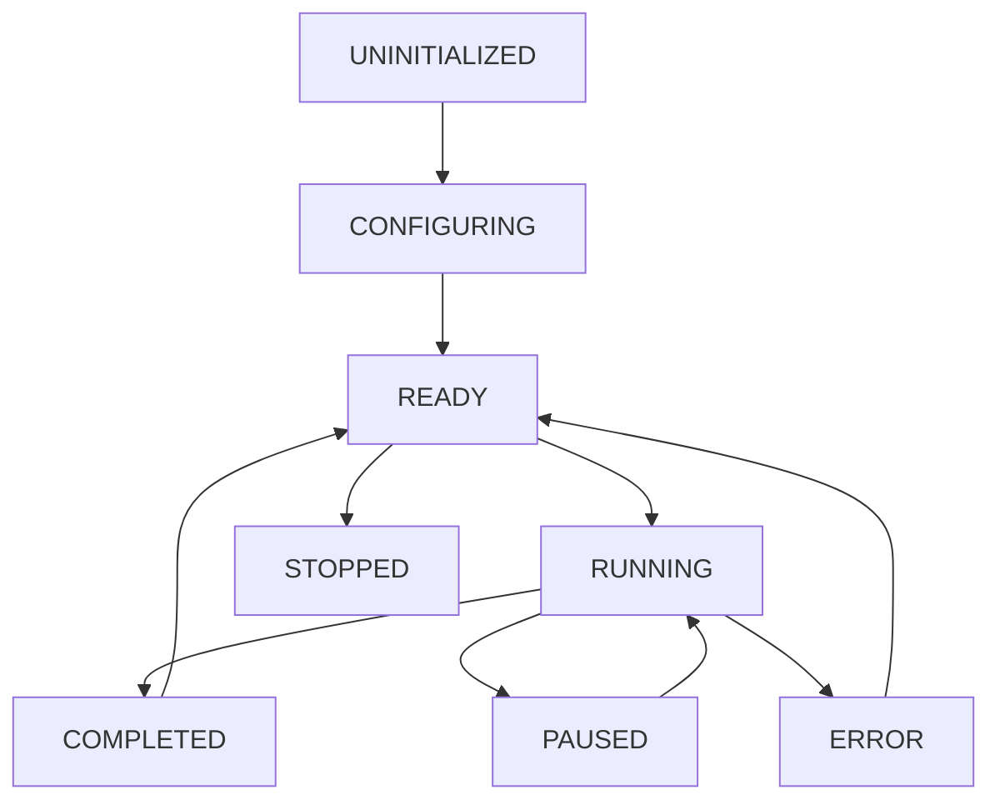

# 操作符基类 (xoperator)

`xpertcorpus.modules.others.xoperator` 模块提供操作符抽象基类和生命周期管理功能，支持状态追踪、配置管理、性能监控和钩子系统。

## 模块概述

操作符基类模块是 XpertCorpus 框架的核心抽象层，负责：
- 定义统一的操作符接口
- 提供完整的生命周期管理
- 支持配置驱动的操作符行为
- 集成错误处理和性能监控
- 提供钩子系统和事件机制

## 核心枚举

### OperatorState (操作符状态)

定义操作符的生命周期状态。

```python
from enum import Enum

class OperatorState(Enum):
    UNINITIALIZED = "uninitialized"    # 未初始化
    CONFIGURING = "configuring"        # 配置中
    READY = "ready"                     # 就绪
    RUNNING = "running"                 # 运行中
    PAUSED = "paused"                   # 暂停
    STOPPED = "stopped"                 # 已停止
    ERROR = "error"                     # 错误状态
    COMPLETED = "completed"             # 完成
```

## 核心类

### OperatorABC (操作符抽象基类)

所有操作符必须继承的抽象基类，定义了统一的操作符接口。

#### 构造函数

```python
def __init__(
    self,
    name: Optional[str] = None,
    config: Optional[Dict[str, Any]] = None,
    **kwargs
)
```

**参数：**
- `name`: 操作符名称
- `config`: 操作符配置
- `**kwargs`: 其他参数

#### 抽象方法

##### run()

核心执行方法，每个操作符必须实现。

```python
@abstractmethod
def run(self, *args, **kwargs) -> Any:
    """执行操作符的核心逻辑"""
    pass
```

##### get_desc()

获取操作符描述信息。

```python
@abstractmethod
def get_desc(self, lang: str = "zh") -> str:
    """获取操作符描述"""
    pass
```

#### 配置管理

##### configure()

配置操作符参数。

```python
def configure(self, config: Dict[str, Any]) -> None
```

**使用示例：**
```python
operator = MyOperator()
operator.configure({
    "batch_size": 32,
    "max_workers": 4,
    "output_format": "jsonl"
})
```

##### validate_config()

验证配置参数的有效性。

```python
def validate_config(self, config: Dict[str, Any]) -> bool
```

##### get_config() / set_config()

获取和设置配置参数。

```python
def get_config(self, key: str = None) -> Any
def set_config(self, key: str, value: Any) -> None
```

**使用示例：**
```python
# 获取所有配置
all_config = operator.get_config()

# 获取特定配置
batch_size = operator.get_config("batch_size")

# 设置配置
operator.set_config("max_workers", 8)
```

#### 钩子系统

##### add_hook()

添加生命周期钩子函数。

```python
def add_hook(
    self,
    hook_type: str,
    func: Callable,
    priority: int = 0
) -> None
```

**支持的钩子类型：**
- `before_run`: 运行前执行
- `after_run`: 运行后执行
- `on_error`: 错误时执行
- `on_state_change`: 状态变化时执行

**使用示例：**
```python
def log_start():
    print(f"开始运行操作符: {operator.name}")

def log_error(error):
    print(f"操作符错误: {error}")

operator.add_hook("before_run", log_start)
operator.add_hook("on_error", log_error)
```

#### 生命周期控制

##### execute()

执行操作符（包含完整的生命周期管理）。

```python
def execute(self, *args, **kwargs) -> Any
```

**执行流程：**
1. 状态检查和更新
2. 执行 `before_run` 钩子
3. 调用 `run()` 方法
4. 执行 `after_run` 钩子
5. 更新状态和统计信息

##### stop()

停止操作符运行。

```python
def stop(self) -> None
```

##### reset()

重置操作符状态。

```python
def reset(self) -> None
```

#### 信息获取

##### get_state()

获取当前状态。

```python
def get_state(self) -> OperatorState
```

##### get_metadata()

获取操作符元数据。

```python
def get_metadata(self) -> Dict[str, Any]
```

**返回信息：**
- 操作符名称和描述
- 当前状态和配置
- 创建和最后更新时间
- 钩子函数信息

##### get_metrics()

获取性能指标。

```python
def get_metrics(self) -> Dict[str, Any]
```

**返回指标：**
- 执行次数和成功率
- 平均执行时间
- 错误统计
- 资源使用情况

##### get_info()

获取完整的操作符信息。

```python
def get_info(self) -> Dict[str, Any]
```

## 管理器类

### OperatorManager (操作符管理器)

提供操作符的创建、列表和信息获取功能。

#### 主要方法

##### create_operator()

创建指定类型的操作符实例。

```python
@classmethod
def create_operator(
    cls,
    operator_type: str,
    name: Optional[str] = None,
    config: Optional[Dict[str, Any]] = None,
    **kwargs
) -> OperatorABC
```

**使用示例：**
```python
# 创建操作符
operator = OperatorManager.create_operator(
    operator_type="llm_cleaner",
    name="my_cleaner",
    config={"model": "gpt-3.5", "temperature": 0.7}
)
```

##### list_operators()

列出所有可用的操作符类型。

```python
@classmethod
def list_operators(cls) -> List[str]
```

##### get_operator_info()

获取指定操作符的详细信息。

```python
@classmethod
def get_operator_info(cls, operator_type: str) -> Optional[Dict[str, Any]]
```

## 工具函数

### get_operator()

从注册器获取操作符类。

```python
def get_operator(name: str, default=None) -> Any
```

**使用示例：**
```python
from xpertcorpus.modules.others.xoperator import get_operator

# 获取操作符类
LlmCleanerClass = get_operator("llm_cleaner")

# 创建实例
cleaner = LlmCleanerClass(config={"model": "gpt-4"})
```

### get_operator_legacy()

向后兼容的操作符获取函数。

```python
def get_operator_legacy(name: str, default=None) -> Any
```

## 使用模式

### 基础操作符实现

```python
from xpertcorpus.modules.others.xoperator import OperatorABC, OperatorState

class TextCleanerOperator(OperatorABC):
    """文本清洗操作符示例"""
    
    def __init__(self, name: str = "text_cleaner", config: Dict[str, Any] = None):
        super().__init__(name=name, config=config)
        
        # 设置默认配置
        default_config = {
            "remove_html": True,
            "remove_urls": True,
            "normalize_whitespace": True
        }
        
        if config:
            default_config.update(config)
        self.configure(default_config)
    
    def run(self, text: str, **kwargs) -> str:
        """执行文本清洗"""
        result = text
        
        if self.get_config("remove_html"):
            result = self._remove_html(result)
            
        if self.get_config("remove_urls"):
            result = self._remove_urls(result)
            
        if self.get_config("normalize_whitespace"):
            result = self._normalize_whitespace(result)
            
        return result
    
    def get_desc(self, lang: str = "zh") -> str:
        if lang == "en":
            return "Text cleaning operator with HTML, URL and whitespace processing"
        return "文本清洗操作符，支持HTML、URL和空白字符处理"
    
    def validate_config(self, config: Dict[str, Any]) -> bool:
        """验证配置参数"""
        required_keys = ["remove_html", "remove_urls", "normalize_whitespace"]
        return all(key in config for key in required_keys)
    
    def _remove_html(self, text: str) -> str:
        # HTML清理逻辑
        pass
    
    def _remove_urls(self, text: str) -> str:
        # URL清理逻辑
        pass
    
    def _normalize_whitespace(self, text: str) -> str:
        # 空白字符标准化逻辑
        pass
```

### 钩子系统使用

```python
# 创建操作符
cleaner = TextCleanerOperator()

# 添加性能监控钩子
def measure_performance():
    import time
    start_time = time.time()
    
    def log_duration():
        duration = time.time() - start_time
        print(f"执行耗时: {duration:.2f}秒")
    
    return log_duration

# 添加钩子
cleaner.add_hook("before_run", measure_performance())
cleaner.add_hook("after_run", lambda: print("清洗完成"))

# 添加错误处理钩子
def error_handler(error):
    print(f"处理错误: {error}")
    # 可以进行错误恢复操作

cleaner.add_hook("on_error", error_handler)
```

### 配置驱动操作

```python
# 配置文件 (config.yaml)
text_cleaner:
  remove_html: true
  remove_urls: true
  normalize_whitespace: true
  custom_patterns:
    - "pattern1"
    - "pattern2"

# 使用配置
import yaml

with open("config.yaml") as f:
    config = yaml.safe_load(f)

cleaner = TextCleanerOperator(config=config["text_cleaner"])

# 动态调整配置
cleaner.set_config("remove_html", False)
cleaner.set_config("custom_patterns", ["new_pattern"])
```

### 批量处理模式

```python
class BatchTextCleaner(OperatorABC):
    """批量文本清洗操作符"""
    
    def run(self, texts: List[str], **kwargs) -> List[str]:
        """批量处理文本"""
        results = []
        batch_size = self.get_config("batch_size", 100)
        
        for i in range(0, len(texts), batch_size):
            batch = texts[i:i + batch_size]
            batch_results = self._process_batch(batch)
            results.extend(batch_results)
            
            # 更新进度
            progress = min((i + batch_size) / len(texts), 1.0)
            self._update_progress(progress)
        
        return results
    
    def _process_batch(self, batch: List[str]) -> List[str]:
        # 批量处理逻辑
        return [self._clean_text(text) for text in batch]
    
    def _update_progress(self, progress: float):
        # 触发进度更新钩子
        self._execute_hooks("on_progress", progress=progress)
```

### 异步操作符

```python
import asyncio
from typing import AsyncIterator

class AsyncTextProcessor(OperatorABC):
    """异步文本处理操作符"""
    
    async def run_async(self, texts: AsyncIterator[str]) -> AsyncIterator[str]:
        """异步处理文本流"""
        max_workers = self.get_config("max_workers", 4)
        semaphore = asyncio.Semaphore(max_workers)
        
        async def process_text(text: str) -> str:
            async with semaphore:
                # 异步处理逻辑
                await asyncio.sleep(0.1)  # 模拟异步操作
                return self._process_text(text)
        
        async for text in texts:
            result = await process_text(text)
            yield result
    
    def run(self, *args, **kwargs):
        """同步接口的异步实现"""
        if asyncio.iscoroutinefunction(kwargs.get("async_mode", False)):
            return self.run_async(*args, **kwargs)
        else:
            # 同步处理
            return super().run(*args, **kwargs)
```

## 状态管理

### 状态转换图



### 状态监控

```python
def monitor_operator_state(operator):
    """监控操作符状态变化"""
    
    def state_change_handler(old_state, new_state):
        print(f"状态变化: {old_state.value} -> {new_state.value}")
        
        if new_state == OperatorState.ERROR:
            print("检测到错误状态，开始恢复流程")
            operator.reset()
        elif new_state == OperatorState.COMPLETED:
            print("操作符执行完成")
            
    operator.add_hook("on_state_change", state_change_handler)
```

## 性能优化

### 内存管理

```python
class MemoryEfficientOperator(OperatorABC):
    """内存高效的操作符"""
    
    def __init__(self, *args, **kwargs):
        super().__init__(*args, **kwargs)
        self._memory_monitor = MemoryMonitor()
    
    def run(self, data_stream, **kwargs):
        """流式处理，避免内存溢出"""
        chunk_size = self.get_config("chunk_size", 1000)
        
        for chunk in self._chunk_data(data_stream, chunk_size):
            # 检查内存使用
            if self._memory_monitor.usage_high():
                self._cleanup_cache()
            
            yield self._process_chunk(chunk)
    
    def _chunk_data(self, data_stream, chunk_size):
        """将数据流分块处理"""
        chunk = []
        for item in data_stream:
            chunk.append(item)
            if len(chunk) >= chunk_size:
                yield chunk
                chunk = []
        
        if chunk:
            yield chunk
```

### 并发处理

```python
from concurrent.futures import ThreadPoolExecutor, ProcessPoolExecutor

class ConcurrentOperator(OperatorABC):
    """支持并发处理的操作符"""
    
    def run(self, data_list, **kwargs):
        max_workers = self.get_config("max_workers", 4)
        use_processes = self.get_config("use_processes", False)
        
        executor_class = ProcessPoolExecutor if use_processes else ThreadPoolExecutor
        
        with executor_class(max_workers=max_workers) as executor:
            futures = [
                executor.submit(self._process_item, item)
                for item in data_list
            ]
            
            results = []
            for future in futures:
                try:
                    result = future.result(timeout=30)
                    results.append(result)
                except Exception as e:
                    self._handle_error(e)
                    results.append(None)
            
            return results
```

## 错误处理

### 错误恢复机制

```python
class ResilientOperator(OperatorABC):
    """具有错误恢复能力的操作符"""
    
    def run(self, data, **kwargs):
        max_retries = self.get_config("max_retries", 3)
        retry_delay = self.get_config("retry_delay", 1.0)
        
        for attempt in range(max_retries + 1):
            try:
                return self._process_data(data)
            except Exception as e:
                if attempt == max_retries:
                    # 最后一次尝试失败
                    self._handle_final_error(e, data)
                    raise
                else:
                    # 记录错误并重试
                    self._log_retry_attempt(e, attempt + 1)
                    time.sleep(retry_delay * (2 ** attempt))  # 指数退避
    
    def _handle_final_error(self, error, data):
        """处理最终错误"""
        error_info = {
            "error": str(error),
            "data_sample": str(data)[:100],
            "operator_state": self.get_state().value,
            "config": self.get_config()
        }
        
        # 记录详细错误信息
        self._execute_hooks("on_error", error_info=error_info)
```

## 最佳实践

### 1. 操作符设计原则

```python
class WellDesignedOperator(OperatorABC):
    """良好设计的操作符示例"""
    
    # 1. 清晰的文档字符串
    """
    Text normalization operator with configurable rules.
    
    Features:
    - Unicode normalization
    - Case conversion
    - Punctuation handling
    - Custom regex patterns
    """
    
    def __init__(self, *args, **kwargs):
        super().__init__(*args, **kwargs)
        
        # 2. 合理的默认配置
        default_config = {
            "unicode_form": "NFKC",
            "case_mode": "preserve",  # preserve, lower, upper
            "normalize_punctuation": True,
            "custom_patterns": []
        }
        
        self.configure(default_config)
    
    def validate_config(self, config: Dict[str, Any]) -> bool:
        # 3. 严格的配置验证
        valid_unicode_forms = ["NFC", "NFD", "NFKC", "NFKD"]
        valid_case_modes = ["preserve", "lower", "upper"]
        
        if config.get("unicode_form") not in valid_unicode_forms:
            return False
        if config.get("case_mode") not in valid_case_modes:
            return False
            
        return True
    
    def run(self, text: str, **kwargs) -> str:
        # 4. 清晰的执行逻辑
        if not isinstance(text, str):
            raise TypeError("Input must be a string")
        
        # 5. 步骤化处理
        result = self._normalize_unicode(text)
        result = self._handle_case(result)
        result = self._normalize_punctuation(result)
        result = self._apply_custom_patterns(result)
        
        return result
    
    def get_desc(self, lang: str = "zh") -> str:
        # 6. 多语言支持
        descriptions = {
            "zh": "文本标准化操作符，支持Unicode、大小写和标点符号处理",
            "en": "Text normalization operator with Unicode, case and punctuation handling"
        }
        return descriptions.get(lang, descriptions["en"])
```

### 2. 测试和验证

```python
import unittest

class TestTextCleanerOperator(unittest.TestCase):
    """操作符单元测试"""
    
    def setUp(self):
        self.operator = TextCleanerOperator()
    
    def test_basic_functionality(self):
        """测试基本功能"""
        input_text = "<p>Hello World!</p>"
        expected = "Hello World!"
        result = self.operator.run(input_text)
        self.assertEqual(result, expected)
    
    def test_configuration(self):
        """测试配置功能"""
        config = {"remove_html": False}
        self.operator.configure(config)
        self.assertFalse(self.operator.get_config("remove_html"))
    
    def test_state_transitions(self):
        """测试状态转换"""
        self.assertEqual(self.operator.get_state(), OperatorState.READY)
        
        self.operator.execute("test")
        self.assertEqual(self.operator.get_state(), OperatorState.COMPLETED)
    
    def test_error_handling(self):
        """测试错误处理"""
        with self.assertRaises(TypeError):
            self.operator.run(None)  # 无效输入
```

### 3. 监控和调试

```python
def setup_operator_monitoring(operator):
    """设置操作符监控"""
    
    # 性能监控
    def performance_monitor():
        metrics = operator.get_metrics()
        if metrics["avg_execution_time"] > 5.0:  # 5秒
            print(f"警告: 操作符 {operator.name} 执行时间过长")
    
    # 错误监控
    def error_monitor(error_info):
        error_count = error_info.get("error_count", 0)
        if error_count > 10:
            print(f"警告: 操作符 {operator.name} 错误次数过多")
    
    # 状态监控
    def state_monitor(old_state, new_state):
        if new_state == OperatorState.ERROR:
            print(f"操作符 {operator.name} 进入错误状态")
    
    operator.add_hook("after_run", performance_monitor)
    operator.add_hook("on_error", error_monitor)
    operator.add_hook("on_state_change", state_monitor)
```

## 注意事项

### 1. 状态管理

- 正确实现状态转换逻辑
- 避免状态不一致问题
- 提供状态恢复机制

### 2. 配置验证

- 严格验证配置参数
- 提供清晰的错误消息
- 支持配置热加载

### 3. 错误处理

- 实现完善的异常处理
- 提供错误恢复机制
- 记录详细的错误信息

### 4. 性能考虑

- 支持流式处理大数据
- 实现内存高效的算法
- 提供并发处理能力

### 5. 测试覆盖

- 编写全面的单元测试
- 进行集成测试
- 性能基准测试

---

**更多信息：**
- [注册系统 (xregistry)](xregistry.md)
- [错误处理 (xerror_handler)](../utils/xerror_handler.md)
- [框架系统 (xframework)](xframework.md) 