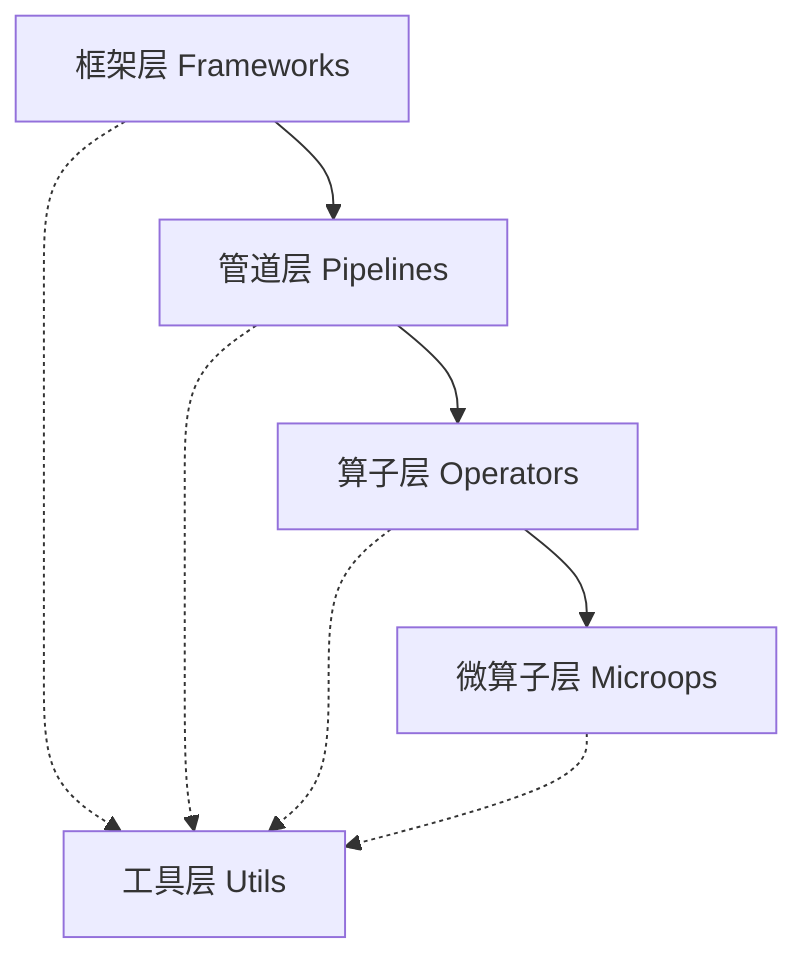

# XpertCorpus

欢迎来到 **XpertCorpus** 文档！

XpertCorpus 是一款轻量级的大模型语料构建端到端框架，专注于从原始语料到训练数据的全流程处理。

## 🚀 特性

- **四层架构设计** - 清晰的分层架构，从微算子到完整框架
- **模块化设计** - 松耦合、可扩展的组件设计
- **多格式支持** - 支持 JSONL、CSV、Parquet、Pickle 等多种数据格式
- **并发处理** - 内置多线程支持，提升处理效率
- **错误处理** - 完善的异常处理和重试机制
- **配置管理** - 灵活的 YAML 配置文件管理

## 🏗️ 架构层次

XpertCorpus 采用四层架构设计：



- **微算子层**: 原子级数据处理操作
- **算子层**: 复合数据处理逻辑
- **管道层**: 数据处理流水线
- **框架层**: 端到端业务框架
- **工具层**: 基础支撑服务

## 📚 快速导航

### 新用户
- [📖 快速入门](tutorials/getting-started/README.md) - 快速上手指南
- [🎯 基础使用](tutorials/basic-usage/README.md) - 基本功能介绍
- [💡 简单示例](examples/simple-examples/README.md) - 快速示例

### 开发者
- [🔧 API 文档](api/README.md) - 完整的 API 参考
- [🏗️ 架构设计](architecture/README.md) - 深入理解系统架构
- [👨‍💻 开发指南](development/README.md) - 参与项目开发

### 高级用户
- [🚀 高级使用](tutorials/advanced-usage/README.md) - 高级功能和技巧
- [⭐ 最佳实践](tutorials/best-practices/README.md) - 推荐的使用模式
- [🔍 性能优化](reference/performance.md) - 性能调优指南

## 🎯 支持的训练格式

- **预训练 (PT)** - 预训练语料生成
- **监督微调 (SFT)** - 指令微调数据生成  
- **思维链 (CoT)** - 推理链数据生成
- **多模态** - 图文等多模态数据处理

## 📦 安装

```bash
pip install xpertcorpus
```

## 🔗 链接

- [GitHub 仓库](https://github.com/rookie-littleblack/XpertCorpus)
- [PyPI 包](https://pypi.org/project/xpertcorpus/)
- [问题反馈](https://github.com/rookie-littleblack/XpertCorpus/issues)

## 📄 许可证

本项目使用 MIT 许可证 - 详见 [LICENSE](https://github.com/rookie-littleblack/XpertCorpus/blob/main/LICENSE) 文件。 